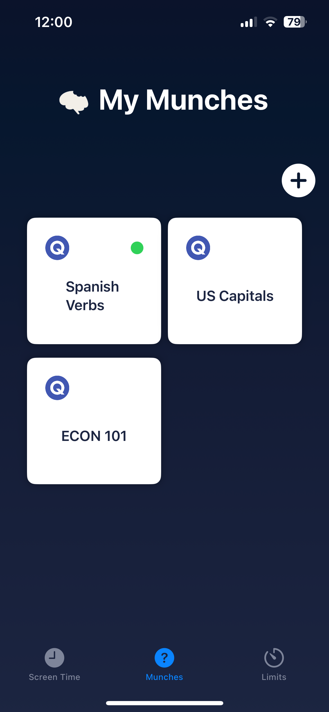

# Screen Time Manager Study Tool App

**Participated in the 2024 European Innovation Academy startup accelerator in Porto, Portugal as the CTO of a global team to create a solution to a problem for college students.**

## Overview

The Screen Time Manager Study Tool is an innovative iOS application designed to help college students manage their screen time more effectively while integrating study habits. The app allows users to view their screen time data, set daily app timers, and import flashcard sets directly from Quizlet. When an app limit is reached, users must answer three questions correctly from their active flashcard set to extend their screen time by 15 minutes.

## Features

- **Screen Time Monitoring:** View detailed statistics of your screen time usage directly within the app.
- **App Timers:** Set daily limits for specific apps to help manage your time effectively.
- **Flashcard Integration:** Import flashcard sets from Quizlet using their API, turning screen time extensions into learning opportunities.
- **Study to Unlock:** When an app timer runs out, the app locks and displays an app shield. Users must answer three questions correctly from their current flashcard set to add an additional 15 minutes to their app usage time.

## Technology Stack

- **Xcode & Swift:** Developed using Xcode and Swift, leveraging native iOS development tools for seamless performance and user experience.
- **FamilyControls Framework:** Utilized for managing screen time and app usage limits.
- **DeviceActivity Framework:** Integrated to track and respond to user interactions with their devices.

## Screenshots

### Screen Time Overview


### Flashcard Sets


### MunchTime Lock Screen


### App Limits


### Flashcard Quiz


## Getting Started

To get started with the Screen Time Manager Study Tool, follow these steps:

1. Clone the repository to your local machine.
    ```bash
    git clone https://github.com/radurbin/Screen-Time-Manager-Study-Tool-App.git
    ```
2. Open the project in Xcode.
3. Ensure you have the latest version of Xcode and Swift installed.
4. Build and run the app on your iOS device.

## Roadmap

- **Enhanced Flashcard Features:** Add support for images and rich content within flashcards.
- **Customizable Timer Intervals:** Allow users to set custom intervals for screen time extensions.
- **Gamification:** Introduce rewards and achievements for consistent study habits and screen time management, specifically with a focus on community engagement.
- **Cross-Platform Support:** Explore expanding the app to Android and other platforms.

## License

This project is licensed under the MIT License. See the [LICENSE](LICENSE) file for details.
